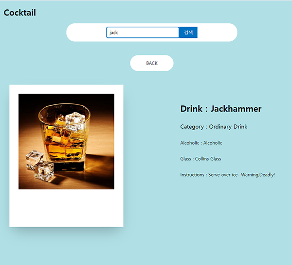
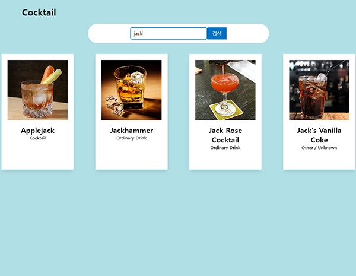

# cocktail

칵테일 API를 이용한 칵테일 검색사이트

## 개요

코로나로 인해 홈술족이 늘어가는 기사를 보았고 평소 관심이 있었던 칵테일에 대해 소개하는 사이트를 만들고자하여 프로젝트를 진행하게 되었습니다.

cocktail에 대한 openApi를 이용해 정보를 가져왔고 javascript의 라이브러리인 React.js를 사용하여 화면을 구성하였습니다.

## 설치방법

```js
  npm install
```

## 기술 스텍

| JavaScript | React |
| :--------: | :---: |
|   ![js]    | ![ts] |

## 구현기능

1. 디테일 페이지

   

2. 검색기능

   

## 프로젝트하면서 어려웠던 점

1. 디테일 페이지를 만들면서 각각 아이템마다 페이지를 구분해서 나타내는 작업에 어려움을 가졌습니다.
   - React-router를 이용하여 라우팅을 설정하였고 useParam를 사용하여 각 item의 id를 전달받아 적용했습니다.
2. 서버에서 받아오는 정보를 캐싱하고 싶었습니다.
   - React-query 의 stale타임을 5초로 지정하고 라우터의 keyword가 바뀔경우 그에 반응하여 새로운 정보를 받아오도록 작업했습니다.

[js]: ./Readme/images/javascript.svg
[ts]: ./Readme/images/logo192.png
